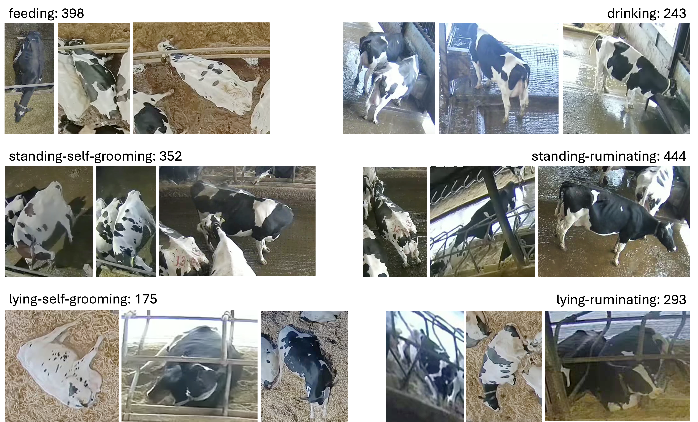

# CattleBehaviours6

**CattleBehaviours6** is a curated video dataset for dairy cattle behaviour recognition.  
It contains **1,905 annotated video clips** covering six indoor cattle behaviours and was developed to support research in computer vision, multimodal learning, animal behaviour recognition, and precision livestock farming.

The dataset accompanies the paper:

> **Cattle-CLIP: A Multimodal Framework for Dairy Cattle Behaviour Recognition from Video**

---

## 📄 Paper

**Huimin Liu, Jing Gao, Daria Baran, Axel X Montout, Neill W. Campbell, Andrew W. Dowsey**

*Cattle-CLIP: A Multimodal Framework for Dairy Cattle Behaviour Recognition from Video.*

**AgriEngineering, 2026, 8(10), 410**

Paper:

https://www.mdpi.com/2624-7402/8/10/410

---

## 📦 Dataset Download

The complete CattleBehaviours6 dataset is publicly available through Zenodo:

### CattleBehaviours6 v1

**Zenodo:**  
https://zenodo.org/records/23064957

**DOI:**  
`10.5281/zenodo.23064957`

Dataset archive:

`CattleBehaviours6.zip`

Approximate compressed size:

**349 MB**

---

## 📊 Dataset Overview

| Property | Description |
|---|---|
| Dataset | CattleBehaviours6 |
| Number of video clips | 1,905 |
| Number of behaviour classes | 6 |
| Modality | RGB video |
| Domain | Dairy cattle behaviour recognition |
| Environment | Indoor dairy farm |
| Primary task | Video behaviour classification |
| Data repository | Zenodo |
| DOI | 10.5281/zenodo.23064957 |

---

## 🐄 Behaviour Classes

CattleBehaviours6 contains six behaviour categories:

1. **Feeding**
2. **Drinking**
3. **Standing self-grooming**
4. **Standing ruminating**
5. **Lying self-grooming**
6. **Lying ruminating**

The behaviour definitions were designed to provide consistent labels for cattle behaviour recognition experiments.

  

  <em>Overview of the six behaviour classes included in the CattleBehaviours6 dataset.</em>

---

## 🎯 Motivation

Automatic monitoring of cattle behaviour can provide useful information related to animal health, welfare and productivity.

However, research on video-based cattle behaviour recognition is often limited by:

- the scarcity of publicly available annotated livestock video datasets;
- limited samples for individual behaviours;
- variation in cattle appearance, posture and environmental conditions;
- the domain gap between general-purpose computer vision datasets and real-world agricultural video.

CattleBehaviours6 was created to provide a curated benchmark for studying these challenges.

---

## 🤖 Cattle-CLIP

CattleBehaviours6 was introduced alongside **Cattle-CLIP**, a multimodal framework for dairy cattle behaviour recognition.

Cattle-CLIP adapts Contrastive Language–Image Pretraining (CLIP) to video-based cattle behaviour understanding by incorporating temporal information and behaviour-specific semantic descriptions.

The framework was evaluated under both:

- **fully supervised learning**, and
- **few-shot learning**

settings.

Please refer to the associated paper for details of the model architecture, experimental setup and benchmark results.
